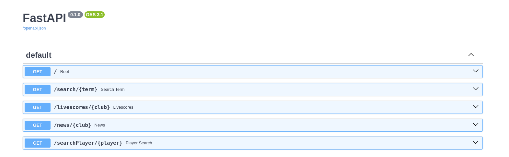

# news-and-match-info-api
This API has endpoints to get football transfer news and matches livescores

## Setup
1. Make sure you are in the working directory
```sh
./
```
2. Install the packages in requirements.txt

```sh
pip install -r requirements.txt
```

3. Start the server (and record logs) with the command below
```sh
gunicorn api.route:app --workers 4 --worker-class uvicorn.workers.UvicornWorker --bind 0.0.0.0:9991 2>&1 | tee -a "all_logs_$(date +%F).log"
```

## Endpoints


- **Search**: Search for club and country club details from DB. Returns club name, image, link and league
- **SearchPlayer**: Search for player details. Returns player name, image, club details and country details

> The following endpoints expect club name as returned from the 2 search endpoints. A single letter change or case change won't locate the club name in the database

- **Livescores**: Return match details for the given day for a particular club or country club
- **News**: Returns the news for a particular club or country club

## How to contribute
Whenever there's some change in code, you need to run docker-rebuild script.
Run the following commands:

```
cd ~/news-and-match-info-api
sh docker-rebuild.sh 
```
